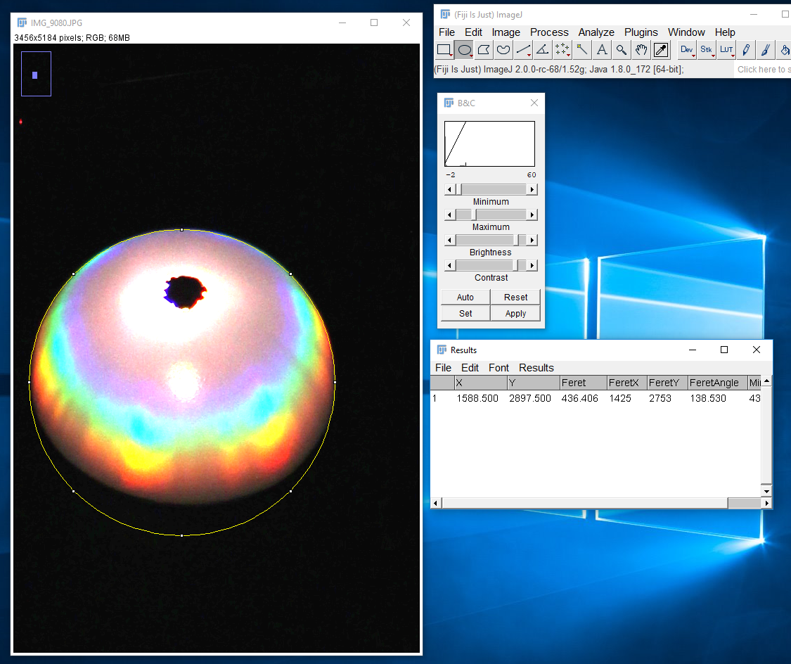

# PingPongBRDF
Use a ping pong ball to quantitatively measure the BRDF of a surface

There are two scripts provided: 
PingPongDrawLines.m will draw lines of constant polar and azimuthal angle over the image and PingPongUnwrawp.m will remap the image from the ping pong ball to (theta, phi) coordinates. 

At the beginning there are a few parameters that you need to fill in for each image- the location in the image of the ping pong ball and the radius (in pixels), as well as the camera angles. I've been finding the coordinates of the center of the ping pong ball and the radius by hand in imageJ:

There are probably a lot of programs you can do this in; If you do use imagej, select analyze-> set measurements to set that you want to see the centroid and feret diameter.  then just press ctrl-M after you've placed the circle. X, Y are the coordinates of the center, and Feret is the diameter of the circle. 

The camera coordinates are determined during measurement, but can be refined after.  PingPongDrawLines.m will show lines of constant theta and phi, the better the bottom line is aligned with the bottom of the ping pong ball, the closer the angle likely is to the actual angle of the camera.

This script does not include a correction for perspective so if the image is taken from close to the ping pong ball, there will be distortion and unwrapped coordinates will not be correct. This correction may be added later. 
